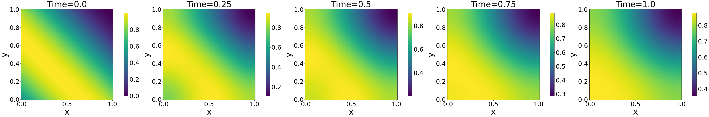

# GappyAE

This repository contains Jupyter notebooks for numerical examples of the paper titled "[Gappy Data Reconstruction using Unsupervised Learning for Digital Twin](https://arxiv.org/abs/2312.07902)".
Note that an open-source FEM solver, [MFEM](https://mfem.org/) was used to generate training data. Please refer to the paper for more details. Since the size of the training data is large, we do not upload it here. The training data will be provided upon request via email at youngkyu_kim@berkeley.edu.

## Data Generation
1. Build [LaSDI](https://github.com/LLNL/LaSDI) or [MFEM](https://mfem.org/) with souce codes and makefiles located in "1_Data_Generation" folder.
2. Run shell scripts in "1_Data_Generation" folder to generate training data.  

Below figures show five snapshots for two extreme parameter values.

*Diffusion simulation solutions from the initial to the final time for param=0.75*

*Diffusion simulation solutions from the initial to the final time for param=1.25*

*Advection simulation solutions from the initial to the final time for param=0.75*

*Advection simulation solutions from the initial to the final time for param=1.25*

*Wave simulation solutions from the initial to the final time for param=0.75*

*Wave simulation solutions from the initial to the final time for param=1.25*

## Model Training
add figure nm모델 설명하는 그림

## Data Reconstruction
explain file name
gappy_XXX_XXX_XXX_XXXX

## Authors
- Youngkyu Kim (KIST)
- Hyeokmin Lee (KIST)
